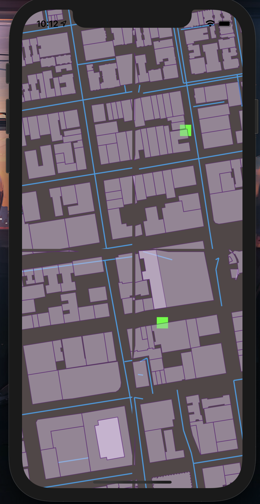
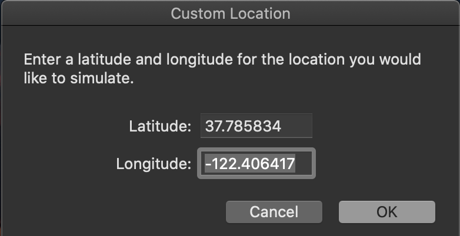
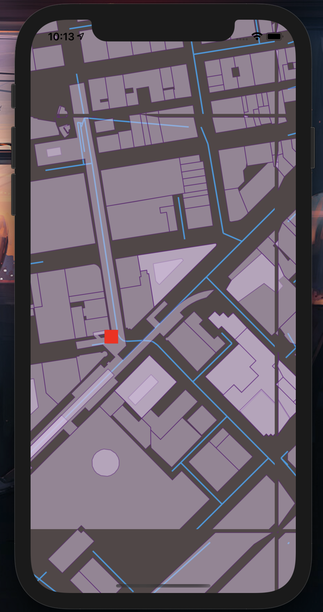

# Rendering Geographical map tiles in Swift5 for game-like map interface 

Allows for rendering of custom maps in 2D vanilla iOS views.

There is no dependency on external rendering services. 

There is map data which needs to be downloaded and pre-processed using scripts as explained later on in this README. However, this can be done once for a region of the globe (one could do it for the entire globe/download the data from somewhere) based on MapBox data using even the Free API, and they play without consuming quote further.

A few powerful features allow for smartly rendering tiles only in the current location.

The project has been upgraded to working condition and Swift 5 as of 2021.

An UIScrollView is used as a viewport for a 2D  based GPS map location  game, a hello world for something like a pokemon go game

## better repository?

Visit this repository for a SceneKit based render, able to allow a more pokemon-go type 3D feel to the map, with cleaner code including post-processing happening in SWIFT without external scripts. 

This does mean it uses quote from MapBox on the fly as it needs to render.

https://github.com/nenuadrian/3D-GPS-location-map-rendering-game-base-swift-ios-scenekit



## initial setup

Assuming you have NodeJS and NPM installed

```
./setup.sh
```

This will just run some `npm install`'s

Optional: Get an API key from MapBox.com and update `tile-processor/index.php` at the top if you want to generate new tiles in the future

## start the app

In a terminal

```
cd game-nodejs-server
npm start
```

Start the APP in the simulator, click Feature -> Location -> Custom Location and you can use LAT 37.785834 LON -122.406417

The tiles to render this are the ones in the screenshots and are part of the codebase

## features

* it dynamically decides which tiles to remove and which to render, a few tiles around the focus point for performance
* code is available to pre-cache tile data from mapbox, preprocess the data and serve it to the app via a a NodeJS API

## how does it work

 * index.js is able to fetch tile data on mvt format from mapbox and convert it to JSON files
 * index.php is able to read available files in the data folder as dumped by index.js and convert them from coordinates to meters and do some cleanup for the app to be able to use the data out of the box
 * the app uses swift code to render the tiles

## generating new tiles

You need to understand a bit about the theory of how maps work, I am working by default with Zoom Level 16 
For LAT 37.785834 LON -122.406417 that means tiles around x in range 10483 to 10555 and y in range 25320 to 25335

The planet is split into tiles, where level 16 means about 611 meters per tile.

An in-depth explanation has been saved and attached in web-maps-cartography-guide.pdf

You can find formulas for these computations on the web and in index.php

Change index.js for loop to generate different ranges of tiles, then run index.php (no parameters to any)

```
cd tile-processor
npm install
node index.js
php index.php
```


## screenshots






